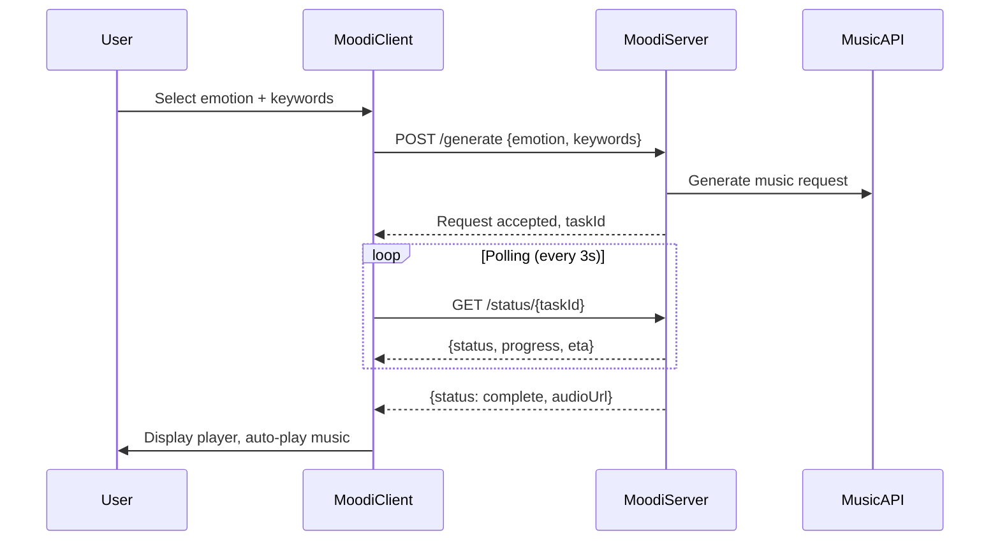

<!--
================================================================================
📋 PRD 한국어 요약 (Korean Summary)
================================================================================

[제품명] Moodi - AI 기반 감정 맞춤 음악 생성 미니앱

[핵심 가치]
사용자의 현재 감정 상태를 기반으로 AI가 맞춤 음악을 생성하여 즉각적인 정서적 위안을 제공합니다.
"앱 실행 → 감정 입력 → 음악 감상"의 3단계 초간단 경험을 제공합니다.

[타겟 사용자]
- 업무 스트레스를 받는 직장인
- 시험 불안을 느끼는 학생
- 일상에서 감정적 지원이 필요한 모든 토스 사용자

[MVP 핵심 기능]
1. 사용자 시스템: Guest 모드 (로그인 불필요), 일일 5개 무료 크레딧 (Storage API로 로컬 관리)
2. 감정 입력: 키워드 칩 + 선택적 텍스트 입력 하이브리드 방식 (TDS 컴포넌트 활용)
3. 음악 생성: 외부 음악 생성 API 연동, 대기 시간 동안 감성적 로딩 애니메이션 제공
4. 앨범 아트: 6개 감정 키워드에 매핑된 사전 정의 에셋 (이미지 생성 API 미사용)
5. 음악 재생: HTML5 Audio Player (Play/Pause만, Seek bar 없음, 백그라운드 재생 불가)
6. 공유 기능: 생성된 음악 링크 공유 (MVP에서는 선택적 기능)

[기술 스택]
- 플랫폼: 앱인토스 WebView (Granite Framework)
- 디자인 시스템: @toss/tds-mobile (비게임 미니앱 필수)
- 빌드 도구: Vite + React + TypeScript

[주요 제약사항]
- WebView 환경에서 백그라운드 재생 불가 (화면 꺼짐/앱 전환 시 음악 정지)
- 현재 다크모드 미지원 (라이트 모드 고정)
- TDS 컴포넌트 사용 필수

[성공 지표]
- 곡 완청률 (Song Completion Rate): 생성된 음악을 끝까지 듣는 비율
- 재생성 비율 (Regeneration Rate): "다시 만들기" 버튼 클릭 비율
- 재방문율 (Return Rate): 7일 이내 재방문 사용자 비율

[리스크]
- 음악 생성 API 지연 시간 (목표: 30초 이내)
- iOS/Android WebView 간 오디오 호환성
- API 비용 관리

================================================================================
-->

# Moodi - Product Requirements Document (PRD)

**Product Name:** Moodi  
**Platform:** AppsInToss WebView (Toss Mini-App)  
**Version:** MVP 1.0  
**Last Updated:** December 27, 2024  
**Author:** Product Team  
**Status:** Draft

---

## Table of Contents

1. [Executive Summary](#1-executive-summary)
2. [Problem Statement & Solution](#2-problem-statement--solution)
3. [Target Users (Personas)](#3-target-users-personas)
4. [User Stories (MVP Scope)](#4-user-stories-mvp-scope)
5. [Functional Requirements](#5-functional-requirements)
6. [UX/UI Guidelines](#6-uxui-guidelines)
7. [Success Metrics (KPIs)](#7-success-metrics-kpis)
8. [Technical Constraints & Risks](#8-technical-constraints--risks)
9. [Out of Scope (Future Versions)](#9-out-of-scope-future-versions)
10. [Appendix](#10-appendix)

---

## 1. Executive Summary

### 1.1 Product Overview

**Moodi** is an AI-powered music therapy mini-app that runs within the Toss app ecosystem. It generates personalized music based on the user's current emotional state, providing instant emotional comfort through a simple 3-tap experience.

### 1.2 Core Value Proposition

> "Instant musical therapy for your mood - Open, Feel, Listen."

Moodi eliminates the friction of finding the right music by letting AI create a personalized track tailored to the user's exact emotional state in under 60 seconds.

### 1.3 Toss Product Principles Alignment

| Principle | Moodi Implementation |
|-----------|---------------------|
| **Simplicity** | 3-step flow: Open → Input Emotion → Listen |
| **Removing Friction** | No login required for first use, emotion input via simple emoji/keyword selection |
| **Customer Obsession** | Delightful waiting experience, empathetic copywriting, screen-on guidance |

### 1.4 Key Technology

- **Music Generation:** External AI Music Generation API (e.g., Suno, MusicGen)
- **Audio Playback:** HTML5 Audio Player
- **Framework:** `@apps-in-toss/web-framework` (Granite)
- **Design System:** `@toss/tds-mobile` (mandatory for non-game apps)

---

## 2. Problem Statement & Solution

### 2.1 Problem

Modern users frequently experience stress, anxiety, and emotional fluctuations but lack a **quick, customized, and accessible** method to find relief. Existing solutions have significant friction:

| Current Solution | Pain Point |
|-----------------|------------|
| Music Streaming Apps | Requires browsing/searching, no personalization based on current mood |
| Meditation Apps | Time-consuming, requires commitment |
| Therapy/Counseling | Expensive, not instantly accessible |
| Generic Playlists | Not personalized, doesn't address specific emotional state |

### 2.2 Solution

Moodi provides a **3-tap experience** for instant musical therapy:

```
[Open App] → [Input Emotion] → [Listen to AI-Generated Music]
```

The user simply expresses their current feeling, and AI generates a unique music track designed to provide emotional comfort within 60 seconds.

### 2.3 Hypothesis

> **"If we provide instant personalized music based on the user's emotional state, users will feel comforted and return to the app when they need emotional support."**

**Validation Criteria:**
- 60%+ Song Completion Rate (users listen to the full track)
- 30%+ users return within 7 days
- Average session duration > 3 minutes

---

## 3. Target Users (Personas)

### 3.1 Primary Persona: "Tired Worker" (피곤한 직장인)

| Attribute | Description |
|-----------|-------------|
| **Name** | 김민수 (32세, 남성) |
| **Occupation** | IT 회사 마케팅 팀장 |
| **Pain Point** | 야근 후 지친 감정을 해소할 방법이 없음. 음악을 찾아보려 해도 에너지가 없음 |
| **Goal** | 빠르게 마음을 진정시키고 싶음 |
| **Behavior** | 퇴근 후 토스앱을 자주 확인 (송금, 자산관리), 짧은 콘텐츠 선호 |
| **Quote** | "딱 5분만 마음이 편해졌으면 좋겠어요" |

### 3.2 Secondary Persona: "Anxious Student" (불안한 학생)

| Attribute | Description |
|-----------|-------------|
| **Name** | 박지은 (22세, 여성) |
| **Occupation** | 대학생 (취업 준비생) |
| **Pain Point** | 시험/면접 전 불안감이 심함. 집중하기 어려움 |
| **Goal** | 불안을 줄이고 마음을 안정시키고 싶음 |
| **Behavior** | 스마트폰 사용 시간이 길고, 토스 혜택 자주 확인 |
| **Quote** | "면접 전에 마음을 진정시킬 수 있으면 좋겠어요" |

### 3.3 Tertiary Persona: "Lonely Night Owl" (외로운 밤샘러)

| Attribute | Description |
|-----------|-------------|
| **Name** | 이서연 (28세, 여성) |
| **Occupation** | 프리랜서 디자이너 |
| **Pain Point** | 밤에 홀로 작업하며 외로움을 느낌 |
| **Goal** | 혼자가 아닌 것 같은 따뜻한 느낌을 원함 |
| **Behavior** | 야간 시간대 앱 사용, 감성적 콘텐츠에 반응 |
| **Quote** | "누군가 나를 위해 만들어준 음악이 있다면..." |

---

## 4. User Stories (MVP Scope)

### 4.1 Core User Stories

| ID | User Story | Priority | Acceptance Criteria |
|----|-----------|----------|---------------------|
| US-01 | As a **stressed user**, I want to **quickly express my current emotion**, so that **I can get personalized music without complex interactions**. | P0 | - Emotion input completes in < 10 seconds<br>- Maximum 2 taps to select emotion |
| US-02 | As a **user waiting for music generation**, I want to **see an engaging and calming animation**, so that **I feel the wait is worthwhile and not frustrating**. | P0 | - Loading animation is visually appealing<br>- Progress indicator shows estimated time<br>- Copywriting is warm and empathetic |
| US-03 | As a **user listening to generated music**, I want to **know that the screen must stay on**, so that **my music doesn't stop unexpectedly**. | P0 | - Clear UI message about screen-on requirement<br>- Non-intrusive but visible indicator |
| US-04 | As a **user who enjoyed the music**, I want to **share the experience with friends**, so that **they can also try Moodi**. | P1 | - One-tap share functionality<br>- Shareable link opens Moodi in Toss app |

### 4.2 Delightful Waiting Experience (Critical UX Requirement)

The music generation latency (typically 20-60 seconds) is inevitable. Instead of hiding it, Moodi transforms this wait into a **positive emotional experience**.

**Waiting Screen Requirements:**

```
┌─────────────────────────────────────┐
│                                     │
│     🎵 [Soft Animation]            │
│                                     │
│   "민수님을 위한 곡을               │
│    정성껏 만들고 있어요..."          │
│                                     │
│   ════════════════░░░░░░  65%      │
│                                     │
│   약 15초 남았어요                   │
│                                     │
│   💡 화면을 유지해주세요            │
│                                     │
└─────────────────────────────────────┘
```

**Key Elements:**
1. **Personalized Message:** Use the user's name from Toss profile
2. **Progress Indicator:** Visual progress bar with estimated remaining time
3. **Warm Copywriting:** Following Toss Tone guidelines (see Section 6.2)
4. **Screen-On Reminder:** Gentle reminder that screen must stay on

---

## 5. Functional Requirements

### 5.0 User Identification & Credit System

**Requirement ID:** FR-00  
**Priority:** P0

**Description:**  
Manage user identification and usage credits without requiring login for MVP.

#### 5.0.1 User Identification (MVP)

For MVP, Moodi operates in **Guest Mode** without requiring Toss Login:

| Approach | Description | Rationale |
|----------|-------------|-----------|
| **Guest Mode** | No login required | Reduces friction, faster time-to-value |
| **Local Storage** | Use `Storage` API from `@apps-in-toss/framework` | Persist credits locally |
| **Future** | Toss Login integration | Enable cross-device sync, premium features |

> **Note:** Moodi is a **non-game app**, so `getUserKeyForGame` (Game Login) is **not available**. Full Toss Login requires server integration with mTLS certificates, which is deferred to post-MVP.

#### 5.0.2 Credit System

Users receive **5 free credits per day** to generate music:

| Feature | Implementation |
|---------|----------------|
| **Daily Credits** | 5 free credits per day |
| **Reset Time** | Midnight local time (00:00) |
| **Storage Key** | `moodi_credits`, `moodi_last_reset_date` |
| **Display** | Show remaining credits on main screen |

**Credit Logic (Pseudocode):**

```typescript
import { Storage } from '@apps-in-toss/framework';

const DAILY_CREDITS = 5;
const STORAGE_KEY_CREDITS = 'moodi_credits';
const STORAGE_KEY_LAST_RESET = 'moodi_last_reset_date';

async function getCredits(): Promise<number> {
  const today = new Date().toDateString();
  const lastReset = await Storage.getItem(STORAGE_KEY_LAST_RESET);
  
  if (lastReset !== today) {
    // New day - reset credits
    await Storage.setItem(STORAGE_KEY_CREDITS, String(DAILY_CREDITS));
    await Storage.setItem(STORAGE_KEY_LAST_RESET, today);
    return DAILY_CREDITS;
  }
  
  const credits = await Storage.getItem(STORAGE_KEY_CREDITS);
  return parseInt(credits || '0', 10);
}

async function useCredit(): Promise<boolean> {
  const credits = await getCredits();
  if (credits <= 0) return false;
  
  await Storage.setItem(STORAGE_KEY_CREDITS, String(credits - 1));
  return true;
}
```

#### 5.0.3 Credit Purchase (MVP Mock)

**Decision:** Actual payment gateway integration is **postponed** for MVP.

| UI Element | MVP Behavior |
|------------|--------------|
| Store Entry | Hidden for public launch OR visible with mock |
| "Buy" Button | Triggers mock success modal, adds virtual credits |
| Price Display | Shows conceptual pricing (no real transaction) |

**Mock Purchase Flow:**

```
┌─────────────────────────────────────┐
│                                     │
│   🎵 크레딧이 부족해요               │
│                                     │
│   [내일 다시 오기]                   │
│                                     │
│   ─────── 또는 ───────              │
│                                     │
│   [크레딧 충전하기] (Coming Soon)    │
│                                     │
└─────────────────────────────────────┘
```

> **Post-MVP:** Integrate In-App Purchase via AppsInToss IAP for consumable credit items.

---

### 5.1 Emotion Input (Hybrid)

**Requirement ID:** FR-01  
**Priority:** P0

**Description:**  
Users input their current emotional state through a hybrid interface combining keyword chip selection and optional free-text input.

#### 5.1.1 Implementation Decision

| Option | Pros | Cons | Decision |
|--------|------|------|----------|
| Emoji Selection Only | Fastest, visual | Limited nuance, accessibility issues | ❌ Not selected |
| Free Text Only | Most expressive | Higher friction, requires typing | ❌ Not for MVP |
| **Keyword Chip + Text** | Balance of speed and nuance | Slightly more complex | ✅ **Selected** |

#### 5.1.2 Core Emotion Keywords (6 Types)

Define **6 core emotion keywords** that map directly to music generation styles and album art:

| Keyword (KR) | Keyword (EN) | Music Style | Color Theme |
|--------------|--------------|-------------|-------------|
| 슬픔 | sad | Melancholic piano, strings | Blue (#4A90D9) |
| 불안 | anxious | Ambient, slow tempo | Purple (#8B5CF6) |
| 화남 | angry | Intense, rhythmic | Red (#EF4444) |
| 우울 | depressed | Lo-fi, muted tones | Grey (#6B7280) |
| 피곤 | tired | Calm, gentle melodies | Warm Orange (#F59E0B) |
| 차분 | calm | Nature sounds, peaceful | Green (#10B981) |

#### 5.1.3 Hybrid Input UI

**Selected Approach: Keyword Chip + Optional Text Input**

```
┌─────────────────────────────────────┐
│                                     │
│   지금 기분이 어때요?                │
│                                     │
│   ┌─────┐ ┌─────┐ ┌─────┐          │
│   │ 슬픔 │ │ 불안 │ │ 화남 │          │
│   └─────┘ └─────┘ └─────┘          │
│   ┌─────┐ ┌─────┐ ┌─────┐          │
│   │ 우울 │ │ 피곤 │ │ 차분 │          │
│   └─────┘ └─────┘ └─────┘          │
│                                     │
│   ─────────────────────────────     │
│                                     │
│   더 자세히 알려주세요 (선택)         │
│   ┌─────────────────────────────┐   │
│   │ 오늘 정말 힘든 하루였어요...   │   │
│   │                             │   │
│   └─────────────────────────────┘   │
│                                     │
│   [음악 만들기] (1 크레딧 사용)       │
│                                     │
└─────────────────────────────────────┘
```

#### 5.1.4 Processing Logic

| Input State | Processing | Example |
|-------------|------------|---------|
| **Keyword Only** | Generate based on keyword directly | 피곤 → Calm, gentle music |
| **Keyword + Text** | Extract sentiment from text, refine keyword parameters | 피곤 + "야근 4일째..." → Extra calming, slower tempo |

**Processing Flow:**

```typescript
interface EmotionInput {
  keyword: 'sad' | 'anxious' | 'angry' | 'depressed' | 'tired' | 'calm';
  text?: string; // Optional additional context
}

function processInput(input: EmotionInput): GenerationParams {
  const baseParams = EMOTION_PRESETS[input.keyword];
  
  if (!input.text || input.text.trim() === '') {
    // Text is empty: use keyword-only generation
    return baseParams;
  }
  
  // Text exists: extract sentiment to modify base params
  const sentiment = extractSentiment(input.text);
  return {
    ...baseParams,
    intensity: sentiment.intensity, // e.g., "very", "slightly"
    additionalPrompt: sentiment.summary,
  };
}
```

#### 5.1.5 TDS Components

| Component | Usage |
|-----------|-------|
| `Chip` | Emotion keyword selection (single-select) |
| `TextField` | Optional text input (multiline, max 200 chars) |
| `BottomCTA` | "음악 만들기" button with credit indicator |
| `Text` | Credit display, helper text |

### 5.2 Music Generation

**Requirement ID:** FR-02  
**Priority:** P0

**Description:**  
Call external music generation API with the user's emotional input and generate a unique track.

**API Integration Flow:**



**Generation Parameters:**
| Parameter | Source | Example |
|-----------|--------|---------|
| `emotion` | User selection | "tired", "anxious", "sad" |
| `intensity` | Keyword selection | "very", "slightly" |
| `duration` | Fixed for MVP | 60-90 seconds |
| `style` | Mapped from emotion | "ambient", "lo-fi", "classical" |

**Error Handling:**
- **Timeout (> 90s):** Show friendly error with retry option
- **API Failure:** Graceful degradation with curated fallback playlist
- **Network Error:** Offline-friendly message with retry

### 5.3 Music Player

**Requirement ID:** FR-03  
**Priority:** P0

**Description:**  
Play the generated music using HTML5 Audio with minimal controls optimized for WebView constraints.

#### 5.3.1 Critical WebView Limitation

> **⚠️ Background playback is NOT supported in WebView MVP.**
> 
> The music will stop if:
> - The screen is turned off
> - The user switches to another app
> - The user minimizes the Toss app

**Mandatory UI Guidance (Toast/Banner):**

> **"화면을 켜 둔 상태에서 감상해주세요 (웹뷰 환경 특성상 화면이 꺼지면 음악이 멈춥니다)."**

This message MUST be displayed prominently when playback begins.

#### 5.3.2 Simplified Player UI

**Design Decision:** No Seek Bar due to streaming implementation complexity.

```
┌─────────────────────────────────────┐
│                                     │
│     🎵 민수님을 위한 음악            │
│                                     │
│     ┌─────────────────────────┐     │
│     │                         │     │
│     │    [Album Art Image]    │     │
│     │    (Emotion-matched)    │     │
│     │                         │     │
│     └─────────────────────────┘     │
│                                     │
│             advancement           │
│                                     │
│     ▶️ / ⏸️  [Play/Pause Button]    │
│                                     │
│        🔄 [처음부터 다시 듣기]        │
│                                     │
│   ┌─────────────────────────────┐   │
│   │ 💡 화면을 켜 둔 상태에서      │   │
│   │    감상해주세요              │   │
│   │    (화면이 꺼지면 음악이      │   │
│   │     멈춥니다)                │   │
│   └─────────────────────────────┘   │
│                                     │
│   [다시 만들기]    [공유하기]        │
│                                     │
└─────────────────────────────────────┘
```

#### 5.3.3 Player Controls (Simplified)

| Control | Behavior | Notes |
|---------|----------|-------|
| **Play/Pause** | Toggle playback | Primary control |
| **Restart** | Play from beginning (0:00) | Replaces seek functionality |
| **Regenerate** | Generate new track with same emotion | Uses 1 credit |
| **Share** | Share via Toss sharing SDK | Opens share sheet |

**Removed for MVP:**
- ❌ Progress Bar / Seek functionality (streaming complexity)
- ❌ Volume control (use device volume)
- ❌ Playback speed control

#### 5.3.4 Screen-On Guidance Implementation

| Element | Specification |
|---------|---------------|
| Type | Persistent banner (not dismissible during playback) |
| Background | TDS `grey100` (#F2F4F6) |
| Text Color | TDS `grey700` (#4E5968) |
| Icon | 💡 or TDS info icon |
| Message | "화면을 켜 둔 상태에서 감상해주세요 (웹뷰 환경 특성상 화면이 꺼지면 음악이 멈춥니다)." |
| Position | Below player controls, above action buttons |

#### 5.3.5 Audio Implementation Notes

```typescript
// Simple audio player without seek
const audioRef = useRef<HTMLAudioElement>(null);

const handlePlayPause = () => {
  if (audioRef.current?.paused) {
    audioRef.current.play();
  } else {
    audioRef.current?.pause();
  }
};

const handleRestart = () => {
  if (audioRef.current) {
    audioRef.current.currentTime = 0;
    audioRef.current.play();
  }
};
```

### 5.4 Result Sharing (Optional for MVP)

**Requirement ID:** FR-04  
**Priority:** P1

**Description:**  
Allow users to share their generated music experience with friends.

**Implementation:**  
Use `share` function from `@apps-in-toss/framework`:

```typescript
import { share } from "@apps-in-toss/framework";

const handleShare = async () => {
  try {
    await share({
      message: "Moodi가 내 기분에 맞는 음악을 만들어줬어요! 🎵",
      url: `intoss://moodi/track/${trackId}`
    });
  } catch (error) {
    console.error('Share failed:', error);
  }
};
```

**Share Content:**
- **Text:** "Moodi가 내 기분에 맞는 음악을 만들어줬어요! 🎵"
- **Link:** Deep link to Moodi mini-app
- **Note:** Shared link opens Moodi intro, not the specific track (for MVP)

### 5.5 Album Art Assets

**Requirement ID:** FR-05  
**Priority:** P0

**Description:**  
Display emotion-matched album art for generated music using pre-defined static assets instead of AI-generated images.

#### 5.5.1 Design Decision

| Approach | Pros | Cons | Decision |
|----------|------|------|----------|
| AI Image Generation | Unique per track | High latency (10-30s), API cost | ❌ Not for MVP |
| **Pre-defined Assets** | Instant display, no cost | Less variety | ✅ **Selected** |

**Rationale:**
- Reduces overall generation latency (music generation already takes 20-60s)
- Eliminates image generation API costs
- Ensures consistent visual quality
- Simplifies error handling

#### 5.5.2 Asset Mapping (6 Emotions)

| Emotion | Asset Filename | Visual Style | Color Palette |
|---------|----------------|--------------|---------------|
| 슬픔 (sad) | `album_sad.png` | Rainy window, soft blue tones | #4A90D9, #A0C4E8 |
| 불안 (anxious) | `album_anxious.png` | Abstract swirls, purple gradient | #8B5CF6, #C4B5FD |
| 화남 (angry) | `album_angry.png` | Bold geometric shapes, red | #EF4444, #FCA5A5 |
| 우울 (depressed) | `album_depressed.png` | Muted landscape, grey tones | #6B7280, #9CA3AF |
| 피곤 (tired) | `album_tired.png` | Sunset, warm orange glow | #F59E0B, #FCD34D |
| 차분 (calm) | `album_calm.png` | Nature scene, green forest | #10B981, #6EE7B7 |

#### 5.5.3 Asset Specifications

| Property | Requirement |
|----------|-------------|
| Format | PNG (with transparency) or WebP |
| Size | 600x600px (1x), 1200x1200px (2x for retina) |
| File Size | < 100KB per asset |
| Style | Soft, abstract, non-distracting |
| Hosting | CDN (e.g., `https://cdn.moodi.app/assets/`) |

#### 5.5.4 Implementation

```typescript
const ALBUM_ART_BASE_URL = 'https://cdn.moodi.app/assets/album';

const ALBUM_ART_MAP: Record<EmotionKeyword, string> = {
  sad: `${ALBUM_ART_BASE_URL}/album_sad.png`,
  anxious: `${ALBUM_ART_BASE_URL}/album_anxious.png`,
  angry: `${ALBUM_ART_BASE_URL}/album_angry.png`,
  depressed: `${ALBUM_ART_BASE_URL}/album_depressed.png`,
  tired: `${ALBUM_ART_BASE_URL}/album_tired.png`,
  calm: `${ALBUM_ART_BASE_URL}/album_calm.png`,
};

function getAlbumArt(emotion: EmotionKeyword): string {
  return ALBUM_ART_MAP[emotion];
}
```

#### 5.5.5 Future Enhancement

Post-MVP, consider:
- Multiple variants per emotion (random selection)
- Seasonal/time-based variations
- AI-generated unique art (with caching)

---

## 6. UX/UI Guidelines

### 6.1 Design System Compliance

**Mandatory:** All non-game mini-apps MUST use TDS (Toss Design System).

**Package:** `@toss/tds-mobile` (for `@apps-in-toss/web-framework` >= 1.0.0)

**Reference:** [TDS Mobile Documentation](https://tossmini-docs.toss.im/tds-mobile/)

### 6.2 Copywriting Guidelines (Toss Tone)

Following the official [UX Writing Guide](https://developers-apps-in-toss.toss.im/design/ux-writing.md):

| Principle | Example (Don't → Do) |
|-----------|---------------------|
| **해요체 (Friendly)** | "생성 중입니다" → "만들고 있어요" |
| **능동형 (Active)** | "음악이 생성됐어요" → "음악을 만들었어요" |
| **긍정형 (Positive)** | "재생할 수 없어요" → "화면을 켜두면 재생할 수 있어요" |
| **캐주얼 (Casual)** | "음악을 들으시겠어요?" → "음악 들을래요?" |

**Moodi Copywriting Examples:**

| Screen | Copy |
|--------|------|
| Intro | "오늘 기분이 어때요?" |
| Loading | "민수님을 위한 곡을 정성껏 만들고 있어요..." |
| Loading Progress | "잠시만요, 거의 다 됐어요" |
| Playback | "민수님을 위해 만든 음악이에요" |
| Screen-On Guide | "화면을 켜둬야 음악이 계속 재생돼요" |
| Error | "잠시 문제가 생겼어요. 다시 시도해 볼까요?" |
| Success Share | "친구에게 공유했어요" |

### 6.3 Visual Design Guidelines

**Tone & Manner:** Warm, Empathetic, Clean

**Color Palette:**

| Usage | Color | Hex |
|-------|-------|-----|
| Primary (Brand) | Moodi Blue | `#6B7FD7` |
| Background | Soft Gradient | `#F8F9FF` → `#FFFFFF` |
| Text Primary | TDS Grey900 | `#191F28` |
| Text Secondary | TDS Grey600 | `#6B7684` |
| Accent | Warm Yellow | `#FFD43B` |

**Branding Configuration:**

```typescript
// granite.config.ts
brand: {
  displayName: '무디',  // Korean name required
  icon: 'https://[cdn]/moodi-icon.png',  // 600x600px, square corners
  primaryColor: '#6B7FD7',
  bridgeColorMode: 'basic',
}
```

### 6.4 Navigation Bar

Following [Non-Game Release Guide](https://developers-apps-in-toss.toss.im/checklist/app-nongame.md):

```
┌──────────────────────────────────────────────────────┐
│  ←  [🎵 무디]           [⚙️]  [···]  [✕]           │
└──────────────────────────────────────────────────────┘
     Back  Brand Logo+Name  Settings  More   Close
```

| Element | Required | Notes |
|---------|----------|-------|
| Back Button | Optional | Show when navigation history exists |
| Brand Logo + Name | **Required** | From console registration |
| Custom Button | Optional | Settings icon (if needed) |
| More (···) | **Required** | System feature (cannot customize) |
| Close (✕) | **Required** | System feature (cannot customize) |

### 6.5 Dark Pattern Prevention

Following [Dark Pattern Prevention Policy](https://developers-apps-in-toss.toss.im/design/consumer-ux-guide.md):

**Prohibited Patterns:**
- ❌ Full-screen popup on app entry
- ❌ Blocking popup on back navigation
- ❌ Forced CTA without alternative (e.g., only "Enable Notifications" with no skip)
- ❌ Unexpected interstitial ads during user flow

**Moodi Compliance:**
- ✅ Users can skip emotion input and browse (if future feature)
- ✅ All popups have clear dismiss option
- ✅ No notification request on first launch
- ✅ No ads in MVP

---

## 7. Success Metrics (KPIs)

### 7.1 Primary Metrics (Hypothesis Validation)

| Metric | Definition | Target | Measurement |
|--------|-----------|--------|-------------|
| **Song Completion Rate** | % of users who listen to 80%+ of generated track | ≥ 60% | `play_duration / track_duration` |
| **Regeneration Rate** | % of sessions where user taps "Regenerate" | ≤ 30% | Lower is better (indicates satisfaction) |
| **7-Day Return Rate** | % of users who return within 7 days | ≥ 30% | Cohort analysis |

### 7.2 Secondary Metrics

| Metric | Definition | Target |
|--------|-----------|--------|
| Generation Success Rate | % of music generation requests that complete successfully | ≥ 95% |
| Average Session Duration | Time from app open to close | ≥ 3 min |
| Share Rate | % of sessions that result in share action | ≥ 10% |
| Drop-off at Loading | % of users who leave during music generation | ≤ 20% |

### 7.3 Analytics Events

| Event Name | Trigger | Properties |
|------------|---------|------------|
| `moodi_app_opened` | App launch | `source`, `timestamp` |
| `emotion_selected` | Emotion emoji tapped | `emotion_type`, `timestamp` |
| `generation_started` | Music generation begins | `emotion`, `keywords`, `timestamp` |
| `generation_completed` | Music ready to play | `duration_ms`, `success` |
| `playback_started` | User presses play | `track_id` |
| `playback_completed` | Track ends or user closes | `played_duration`, `total_duration` |
| `regenerate_tapped` | Regenerate button pressed | `previous_emotion` |
| `share_tapped` | Share button pressed | `track_id` |

---

## 8. Technical Constraints & Risks

### 8.1 WebView Constraints

| Constraint | Impact | Mitigation |
|------------|--------|------------|
| **No Background Playback** | Music stops when screen off or app backgrounded | Clear UI guidance, future: native audio module |
| **Light Mode Only** | No dark mode support currently | Design for light mode, prepare for future dark mode |
| **No Pinch Zoom** | Cannot zoom UI elements | Ensure accessibility with adequate text sizes |
| **TDS Mandatory** | Must use Toss Design System | Benefit: Consistent UX, faster review approval |

### 8.2 Technical Risks

| Risk | Probability | Impact | Mitigation |
|------|------------|--------|------------|
| **API Latency > 60s** | Medium | High - User drop-off | Engaging waiting UX, timeout with retry |
| **API Cost Overrun** | Medium | Medium - Budget impact | Rate limiting, usage monitoring |
| **Audio Format Incompatibility** | Low | High - No playback on some devices | Test on multiple iOS/Android WebViews, use widely supported formats (MP3/AAC) |
| **API Provider Outage** | Low | High - Complete service failure | Fallback to curated playlist, graceful error handling |
| **Memory Leaks (Audio)** | Medium | Medium - App crash | Proper audio resource cleanup, testing |

### 8.3 Performance Requirements

| Metric | Requirement |
|--------|-------------|
| Time to First Interaction | < 2 seconds |
| Music Generation Time | < 60 seconds (target: 30s) |
| Audio Playback Start | < 1 second after generation complete |
| Memory Usage | < 100MB |
| Data Usage per Session | < 5MB |

### 8.4 Security Considerations

- API keys stored server-side only
- No sensitive user data collected beyond Toss profile (name)
- Audio files served via HTTPS
- No persistent storage of generated music on device

---

## 9. Out of Scope (Future Versions)

The following features are intentionally excluded from MVP to maintain focus:

### 9.1 Feature Exclusions

| Feature | Reason for Exclusion | Target Version |
|---------|---------------------|----------------|
| User History / Library | Increases complexity, requires storage | v1.1 |
| Background Playback | Requires native module integration | v1.2 |
| Music Download | Storage management, licensing considerations | v1.2 |
| Social Features (Comments, Likes) | Scope creep, requires backend infrastructure | v2.0 |
| Dark Mode | Platform limitation (AppsInToss) | When supported |
| Multiple Language Support | Focus on Korean market first | v1.1 |
| Custom Music Duration | Simplicity over customization for MVP | v1.1 |
| Toss Login Integration | Server-side complexity (mTLS) | v1.1 |
| Seek Bar / Progress Control | Streaming implementation complexity | v1.1 |
| AI-Generated Album Art | Additional API cost and latency | v1.2 |

### 9.2 Payment & Store (MVP Decision)

**Decision:** Actual payment gateway integration is **postponed** for MVP.

| Component | MVP Status | Post-MVP Plan |
|-----------|------------|---------------|
| Store UI | Hidden OR Mock-only | Full In-App Purchase |
| "Buy Credits" Button | Mock success modal | Apple/Google IAP integration |
| Premium Subscription | Not available | v2.0 with recurring billing |
| Credit Purchase History | Not tracked | Server-side with Toss Login |

**MVP Options for Store:**

| Option | Description | Recommendation |
|--------|-------------|----------------|
| **Option A: Hide Store** | Remove Store entry point entirely | ✅ Recommended for public launch |
| **Option B: Mock Store** | Show Store UI, but "Buy" triggers mock success | For internal testing only |

**Mock Store Behavior (Option B):**

```typescript
const handleMockPurchase = async (creditAmount: number) => {
  // Show mock purchase confirmation
  const confirmed = await showConfirmDialog({
    title: '크레딧 구매 (테스트)',
    message: `${creditAmount} 크레딧을 추가할까요?`,
  });
  
  if (confirmed) {
    // Add virtual credits locally
    const currentCredits = await getCredits();
    await Storage.setItem(STORAGE_KEY_CREDITS, String(currentCredits + creditAmount));
    
    // Show success toast
    showToast('크레딧이 추가됐어요! (테스트 모드)');
  }
};
```

**Post-MVP Payment Integration:**
- Integrate AppsInToss In-App Purchase (IAP) for consumable items
- Reference: [IAP Development Guide](https://developers-apps-in-toss.toss.im/iap/develop.md)
- Credit packages: 10 credits, 30 credits, 100 credits
- Require Toss Login for purchase tracking

---

## 10. Appendix

### 10.1 Competitive Analysis

| Product | Pros | Cons | Moodi Differentiation |
|---------|------|------|----------------------|
| Spotify "Mood" Playlists | Large library, offline | Not personalized, requires browsing | AI-generated, instant, personalized |
| Endel | AI-generated soundscapes | Subscription required, complex | Free MVP, simpler emotion input |
| Calm | High quality, meditation focus | Paid, requires time commitment | Free, instant, mood-focused |
| YouTube Music | Free tier available | Ads, not personalized | No ads, AI-personalized |

### 10.2 Technical Dependencies

| Dependency | Version | Purpose |
|------------|---------|---------|
| `@apps-in-toss/web-framework` | >= 1.0.0 | Core framework |
| `@toss/tds-mobile` | Latest | Design system |
| `react` | 18.x | UI library |
| `vite` | 5.x | Build tool |
| Music Generation API | TBD | AI music generation |

### 10.3 Reference Documents

- [AppsInToss Overview](https://developers-apps-in-toss.toss.im/intro/overview.md)
- [WebView Development Guide](https://developers-apps-in-toss.toss.im/tutorials/webview.md)
- [TDS Mobile Documentation](https://tossmini-docs.toss.im/tds-mobile/)
- [UX Writing Guide](https://developers-apps-in-toss.toss.im/design/ux-writing.md)
- [Non-Game Release Checklist](https://developers-apps-in-toss.toss.im/checklist/app-nongame.md)
- [Mini-App Branding Guide](https://developers-apps-in-toss.toss.im/design/miniapp-branding-guide.md)
- [Dark Pattern Prevention Policy](https://developers-apps-in-toss.toss.im/design/consumer-ux-guide.md)

### 10.4 Glossary

| Term | Definition |
|------|------------|
| **AppsInToss** | Toss's mini-app platform allowing 3rd party services within the Toss app |
| **Granite** | The framework (formerly Bedrock) for building AppsInToss mini-apps |
| **TDS** | Toss Design System - required UI component library |
| **WebView** | Browser-based rendering within native app container |
| **Bridge View** | Transition screen shown when entering a mini-app from Toss |

---

## Document History

| Version | Date | Author | Changes |
|---------|------|--------|---------|
| 0.1 | 2024-12-27 | Product Team | Initial draft |

---

*This PRD follows Toss Product Principles: Simplicity, Removing Friction, Customer Obsession.*
